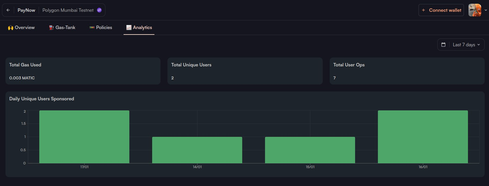

## Getting Started

This is a Proof of Concept made to test biconomy Account Abstraction.
In this project we mint a brand new NFT without pay any GAS. The transaction GAS is paid by a GAS tank on biconomy account.




## You can login with any social network.

First, run the development server:

```bash
npm run dev
# or
yarn dev
# or
pnpm dev
# or
bun dev
```

Open [http://localhost:3000](http://localhost:3000) with your browser to see the result.

You can start editing the page by modifying `app/page.tsx`. The page auto-updates as you edit the file.
